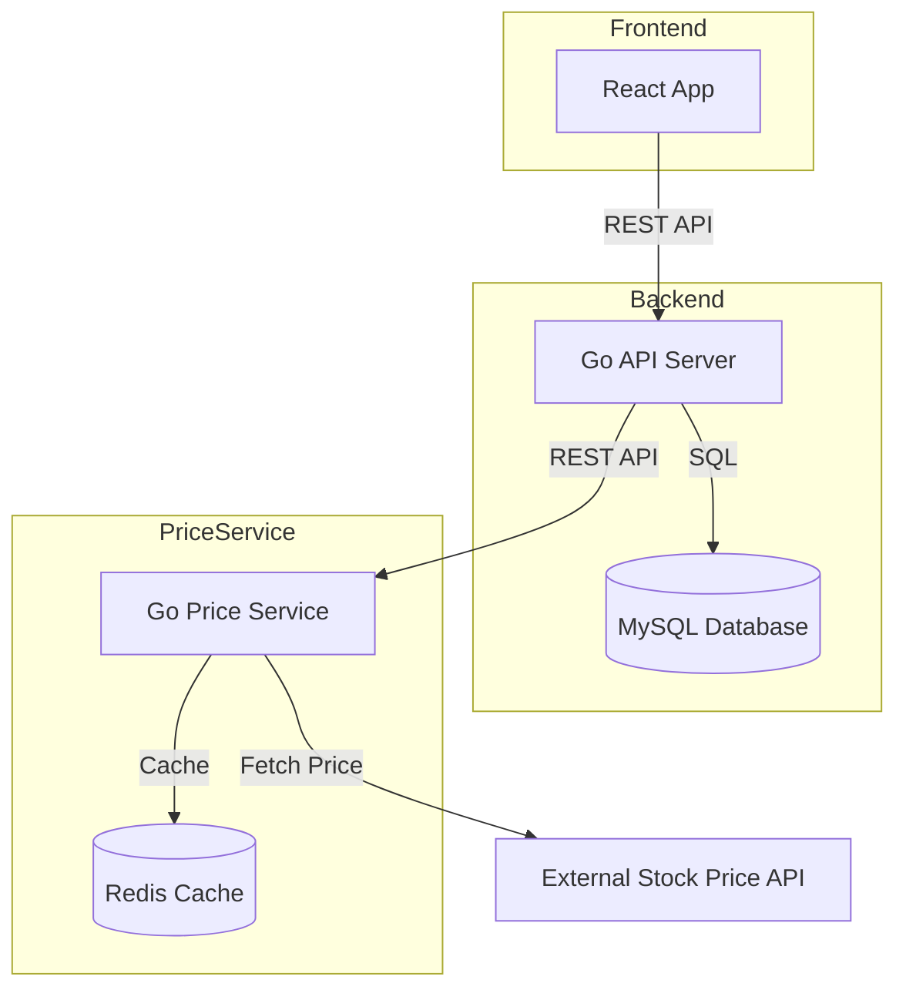

# Zenfolio - Manage Your Unified Portfolio With Peace in Mind

Hi there! 👋 Welcome to Zenfolio—a unified dashboard for managing your portfolio across multiple trading platforms. Upload your trading history screenshots and instantly view all your assets in one place. Explore, analyze, and enjoy a seamless portfolio experience!

## 🎨 Features

- **Portfolio Management**: Centralized dashboard to track all stock holdings performance with comprehensive historical trends and analytics
- **Transaction History**: Upload trading records and let the AI-powered system intelligently parse buy/sell/dividend transactions
- **Performance Metrics**: Calculate total assets, realized/unrealized returns, annualized rates (XIRR), and detailed gain/loss analysis
- **Real-time Pricing**: Seamless integration with external price services for current market data and historical price tracking
- **Responsive UI**: Modern React interface featuring shadcn/ui components with a clean, calming design theme
- **Containerized**: Fully containerized architecture with Docker for streamlined development and deployment workflows
- **AI-powered Workflow**: Prompts and instructions that leverage the power of Github Copilot

## 🏗️ Architecture

### System Architecture Diagram



### File Structure

```
├── frontend/         # React + TypeScript + Vite (Containerized)
├── backend/          # Go API server with Gin framework (Containerized)
├── price_service/    # Go microservice for stock price data (Containerized)
└── docker-compose.yml # Complete container orchestration
```

### Services Overview

- **Frontend**: React application served in Docker container with hot-reload development
- **Core API**: Transactions, portfolio management, chart metrics calculation, user authentication
  - **Database**: MySQL for persistent storage
- **Price Service**: Stock price fetching and caching with Redis
  - **Cache**: Redis cache for better performance

## 🛠️ Tech Stack

| Component        | Technology                         |
| ---------------- | ---------------------------------- |
| Core API         | Go, Gin, GORM                      |
| Frontend         | React, TypeScript, pnpm, Vite      |
| Database         | MySQL 8.0                          |
| Cache            | Redis                              |
| Containerization | Docker, Docker Compose             |
| UI Framework     | Tailwind CSS, shadcn/ui, Storybook |
| State Management | Redux Toolkit                      |

## 🚀 Quick Start

### Prerequisites

- Docker and Docker Compose
- Go 1.21+ (for local development)
- Node.js 18+ (for local development)

### Run with Docker (Recommended)

1. **Clone the repository**

   ```bash
   git clone https://github.com/KatnessChen/zenfolio.git
   cd zenfolio
   ```

2. **Set up environment variables**

   ```bash
   cp .env.example .env
   # Edit .env with your configuration
   ```

3. **Start all services**

   ```bash
   make dev-up
   ```

4. **Access the application**
   - Frontend: http://localhost:3000
   - Backend API: http://localhost:8080/api/v1/health
   - Price Service: http://localhost:8081/health

### Available Commands

Please refer to the [Makefile](./Makefile) for all available commands.

## 📊 API Documentation

### Core API Endpoints

See [Core API Endpoints](./backend/README.md#api-endpoints) for full documentation of portfolio and transaction routes.

### Price Service Endpoints

See [Price Service API Endpoints](./price_service/README.md#api-endpoints) for full documentation of price service routes.

## Deployment Methods

WIP

## 📝 License

This project is licensed under the MIT License - see the [LICENSE](LICENSE) file for details.

---

Built with ❤️ using Go and React
